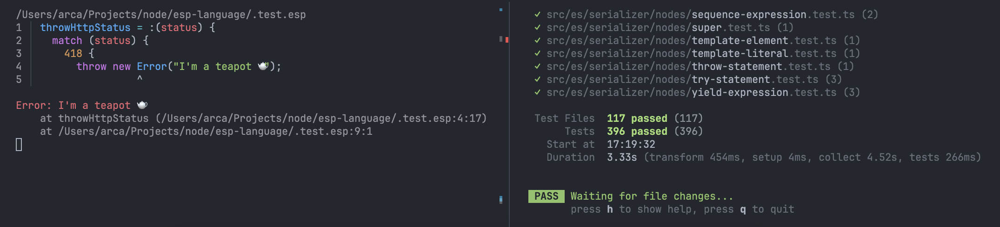

# ES+

This is a basic and experimental proof of concept for an ECMAScript-like language/runtime. The idea is that it should remove the not-so-good parts of JavaScript and add a whole bunch of lacking features.

I will probably rewrite this from scratch in the future.
